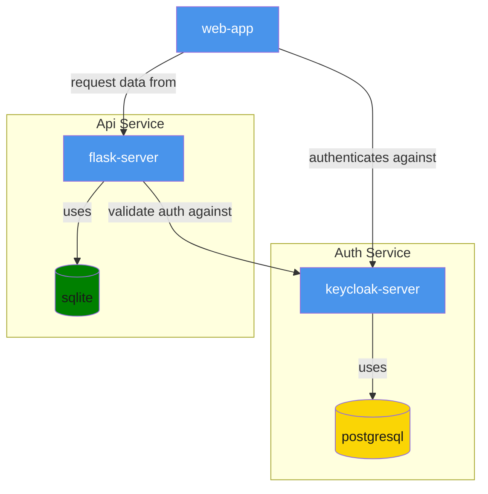
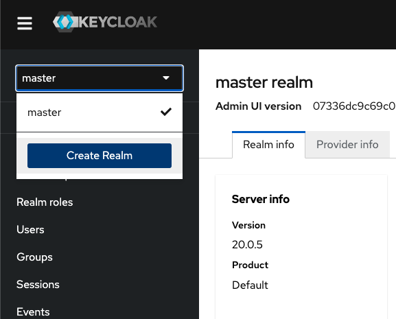
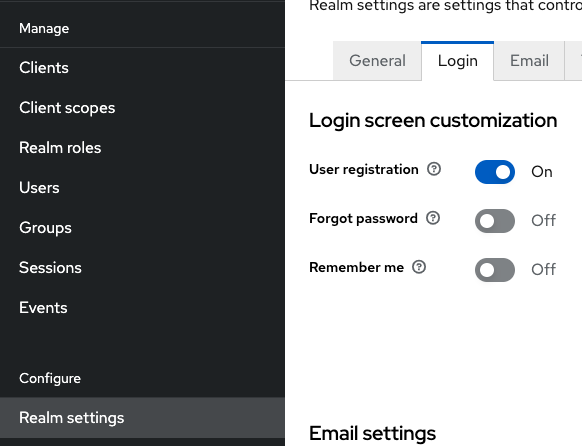
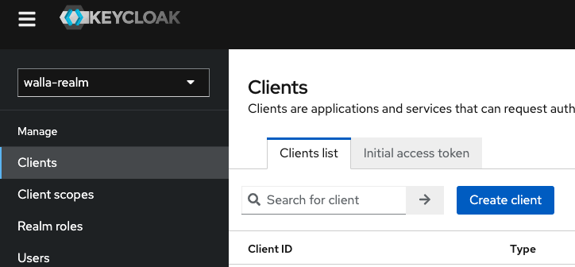
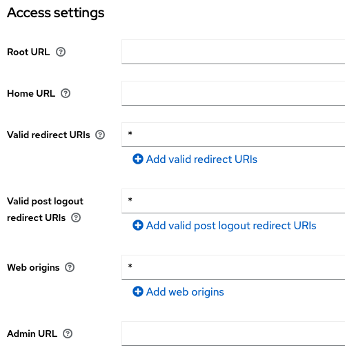
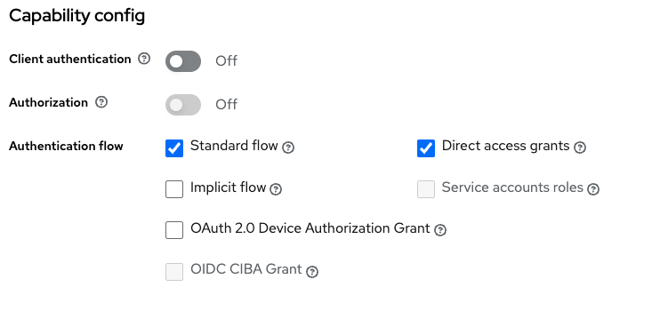

# Example of an Auth Service using Keycloak

This is a example project to show a simple use case of Keycloack as auth service and how to interact with a web app and an api.

The web app is a simple React app that will authenticate against the Keycloak server

The API is a simple Flask app that will validate the requests by checking the token sent in headers against the keycloak server.

## Diagram



## Installation and Setting Up

There are multiple ways to set this example. The simpler one is by running all services at the same time using Docker Compose:

```bash
docker-compose up
```

Second option is by running each service separately (using docker or manually)

### Keycloak Start and Setup

Follow [keycloak auth instructions](keycloak-auth/README.md)

After that, follow instructions set in [here](#realm-settings)

## Web Client Start and Setup

Follow [web client instructions](keycloak-web/README.md) (using the client settings created in the previous step)

If you click on `Login` button, a login form should appear, witht he ability to registered a new user. Follow those instructions and you will return to the home page with logged in data

## Keycloack Setup

### Realm Settings

Go to realm section and create a new one. For this example lets called it "myrealm"



We will be using the default login provided by Keycloak, so we will be allowing user registration too.
Go to Realm Settings and enable the `User Registration` option



### Client Settings

Go to Clients section and create a new client. For this example lets called it "client-web"



This will be the client for the webapp and we should provide the proper urls allowed to interact with this client.
For the sake of this test, we will use a wildcard (\*), but in PROD we should include the proper urls here



In the Capability config we will only set Standard Flow and Direct Access grants


