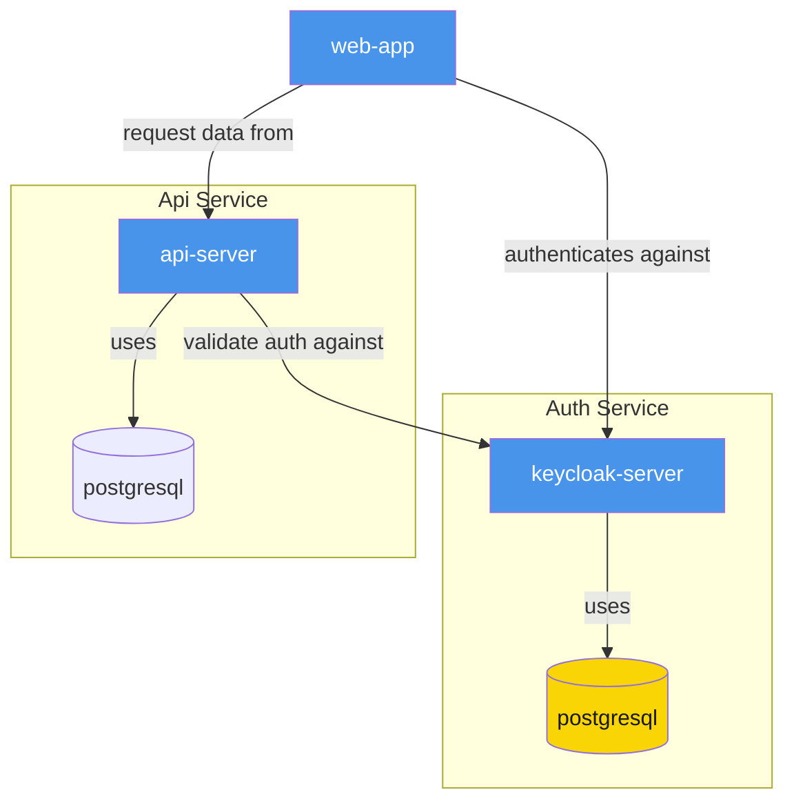

# Keycloak Auth Service with Web Client and Api Client integration

This is a example project to show a simple use case of Keycloack as auth service and how to interact with a web app and an api.

## Keycloak Start and Setup

Follow [keycloak auth instructions](keycloak-auth/README.md)

### Realm Settings

1. Go to realm section and create a new one. For this example lets called it "myrealm"

2. We will be using the default login provided by Keycloak, so we will be allowing user registration too.
   Go to Realm Settings and enable the `User Registration` option

### Client Settings

1. Go to Clients section and create a new client. For this example lets called it "client-web"

2. This will be the client for the webapp and we should provide the proper urls allowed to interact with this client.
   For the sake of this test, we will use a wildcard (\*), but in PROD we should include the proper urls here

## Web Client Start and Setup

Follow [web client instructions](keycloak-web/README.md) (using the client settings created in the previous step)

If you click on `Login` button, a login form should appear, witht he ability to registered a new user. Follow those instructions and you will return to the home page with logged in data
